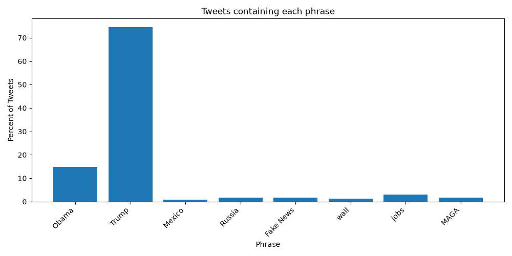

# [lab-web-data](https://csci40.rtealwitter.com/topics/05_web_scraping/lab.html)

This table and bar chart show the percent of tweets in the 2009-2018 archive for each keyword, ignoring capitalization.

| Phrase       | Percent of Tweets |
|--------------|-------------------|
|        Obama | 14.94             |
|        Trump | 74.54             |
|       Mexico | 0.87              |
|       Russia | 1.76              |
|    Fake News | 1.70              |
|         wall | 1.32              |
|         jobs | 3.07              |
|         MAGA | 1.80              |

